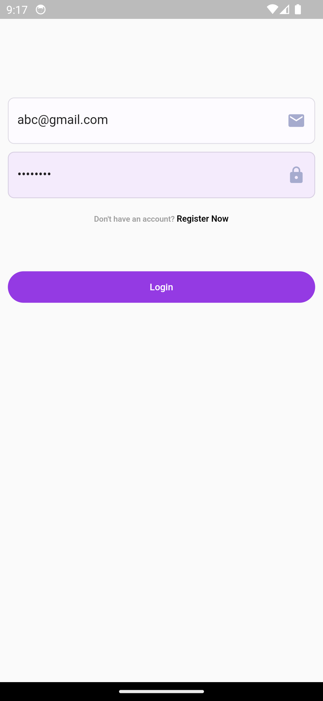
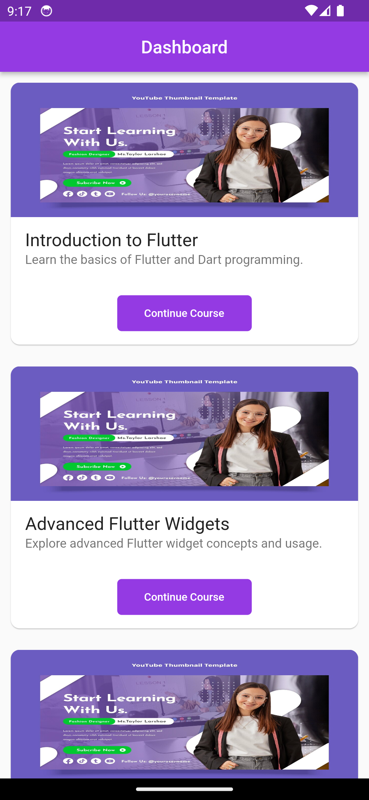
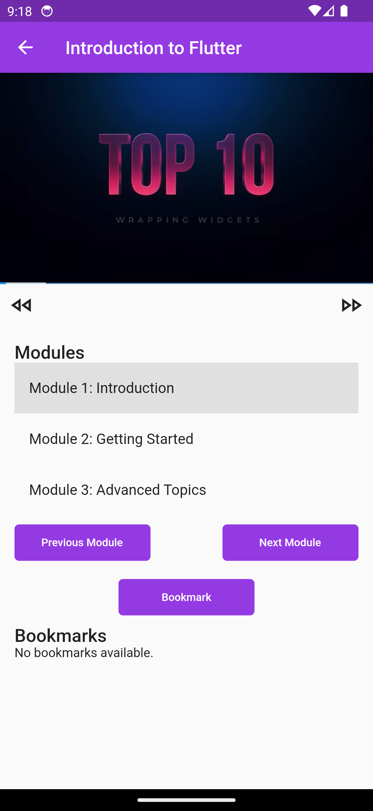
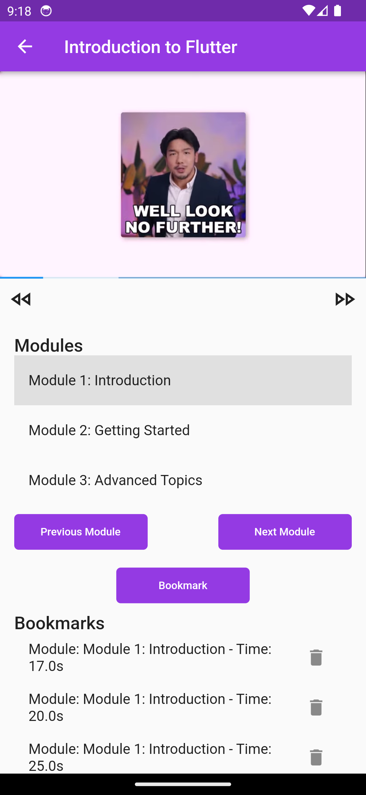
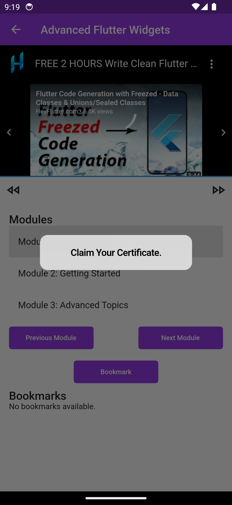
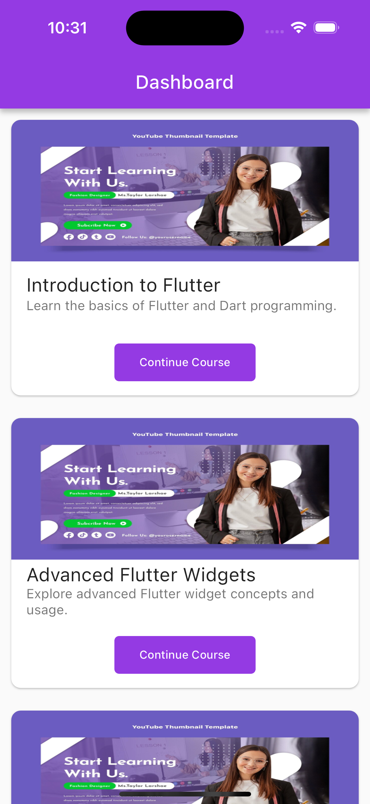
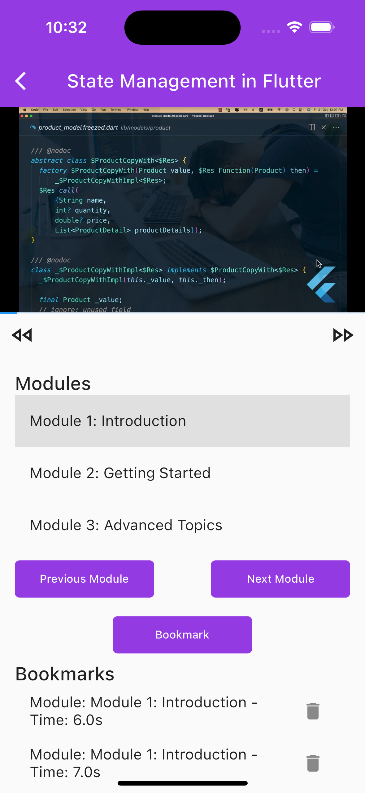

# interactive_cares_task

## Features
- Firebase Authentication.
- Login/Signup Option.
- Dashboard with list of enrolled courses.
- Course Player Screen.
- State Management: Getx.
- Clean Code.

## Flutter Edtech Application Documentation
Authentication Setup
The Flutter Edtech application utilizes Firebase Authentication for user authentication. The setup involves the following steps:

## Firebase Project Creation:

- Create a new Firebase project on the Firebase Console.
- Configure your project settings.
- Enable Authentication:

- In the Firebase Console, navigate to the "Authentication" section.
- Enable the desired authentication providers (Email/Password).
- Setup Firebase in Flutter:

- Add the Firebase configuration files (google-services.json for Android, GoogleService-Info.plist for iOS) to your Flutter project.
- Integrate Firebase Authentication in Flutter:

## Add the necessary dependencies to your pubspec.yaml file:

## Third-Party Services
- Youtube Player Flutter:
  The youtube_player_flutter package is used for embedding YouTube videos in the course player.

-Add the following dependency to your pubspec.yaml:

